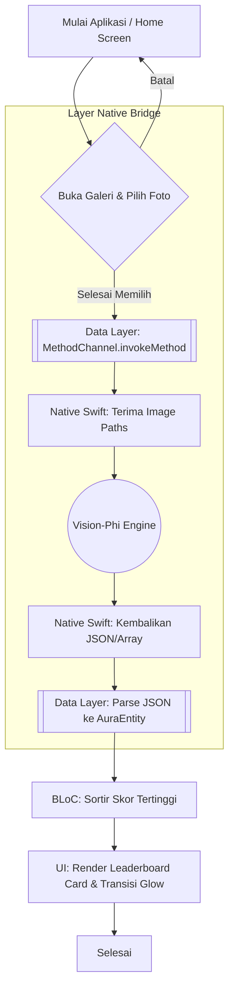
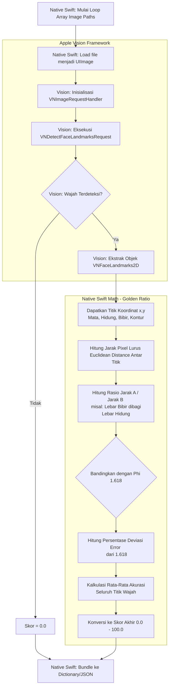
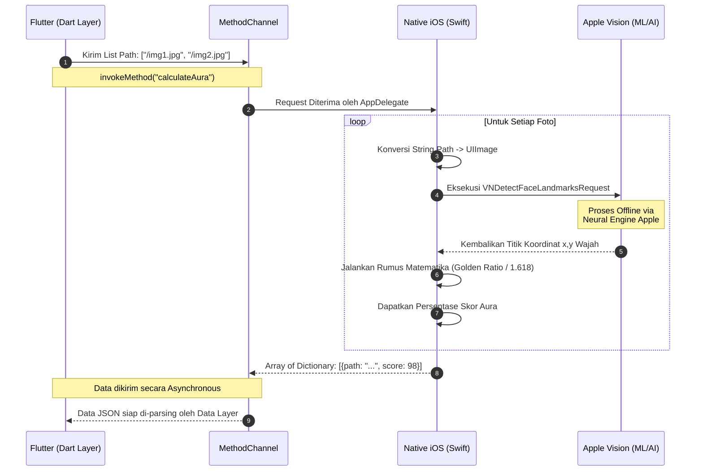
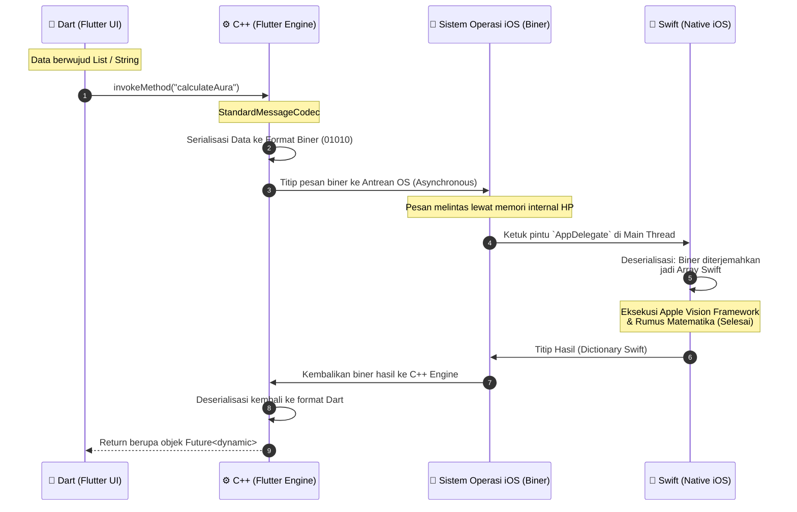
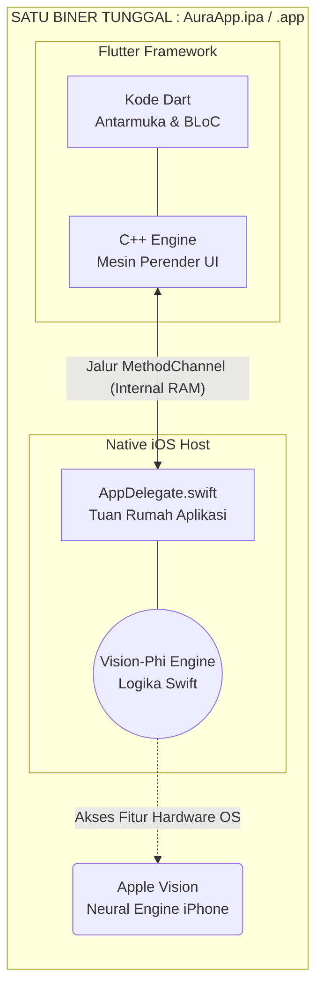

# Technical Requirements Document (TRD): BidadariMeter (Clean Architecture Edition)

## 1. Arsitektur Sistem (Clean Architecture & Native Bridge)
Sistem ini menggunakan standar industri **Clean Architecture** (Presentation, Domain, Data) yang dikombinasikan dengan **Decoupled Native Mobile Architecture** (MethodChannel) dan pola **Dependency Injection (DI)**. 

Tujuannya agar modul Tampilan (UI) dan Otak Pemroses (Matematika & Native Swift) bekerja sebagai entitas terpisah (*loosely coupled*) yang saling berkomunikasi lewat jembatan antarmuka (Interface/Contract).

## 2. Tech Stack (Spesifikasi Teknologi)
Berikut adalah daftar lengkap teknologi yang digunakan beserta alasan dan kegunaannya masing-masing dalam aplikasi ini:

### 2.1 Flutter / Dart (Lapisan Antarmuka & Logika Bisnis)
*   **Flutter & Dart (Framework Utama):** Digunakan untuk merancang UI yang sangat *fluid* dan animasi sinematik dengan performa tinggi.
*   **Clean Architecture (Pola Arsitektur):** Memisahkan kode menjadi lapisan `Presentation`, `Domain`, dan `Data`. Kegunaannya agar kode mudah di-*maintenance* dan fungsi UI dengan logika mesin benar-benar terisolasi.
*   **BLoC / Cubit (`flutter_bloc`):** *State Management* utama. Kegunaannya memisahkan *Business Logic* dari UI. Cubit akan memancarkan perubahan status layar (misal: *Initial* ➡️ *Scanning* ➡️ *Success*).
*   **Dependency Injection (`get_it`):** Kontainer sentral. Kegunaannya agar antar-kelas (*UseCase*, *Repository*, *Cubit*) bisa saling berkomunikasi tanpa di-inisialisasi secara *hardcode* (*loosely coupled*).
*   **Equatability (`equatable`):** Pustaka pembanding objek. Sangat berguna bersama *Cubit* agar layar tidak melakukan *render* ulang membuang memori jika status datanya sama persis.
*   **Hardware Access (`image_picker`):** Pustaka (Library) resmi buatan tim pengembang **Flutter (`flutter.dev`)**. Kegunaannya di sisi Dart adalah untuk meminta izin privasi OS dan membuka Galeri (*Camera Roll*) iOS agar *user* bisa menyeleksi beberapa foto sekaligus.
*   **Visual Effects (Native UI Dart):** Mengandalkan `CustomPaint` (untuk menggambar animasi laser *scanner* dari nol), `AnimationController` (mengatur durasi *loop* laser), dan `BackdropFilter` (menciptakan efek blur kaca / *Glassmorphism* bergaya premium).

### 2.2 Native iOS (Lapisan Pemrosesan & Kecerdasan Buatan)
*   **Swift (Bahasa Pemrograman):** Bahasa asli buatan Apple. Kegunaannya untuk mengelola logika komputasi berat dengan akses kecepatan penuh ke *hardware* iPhone.
*   **Apple Vision Framework (`VNDetectFaceLandmarksRequest`):** Teknologi *Computer Vision* resmi bawaan sistem Apple. Kegunaannya untuk melakukan *scan* wajah dan memetakan koordinat spesifik (mata, bibir, kontur wajah) murni secara lokal tanpa internet.
*   **Swift Native Math (Geometri):** Matematika bawaan Swift. Kegunaannya untuk mengkalkulasi *Euclidean Distance* (jarak piksel antar titik wajah) dan membandingkannya dengan rasio kecantikan mutlak (*Phi / Golden Ratio* = 1.618).
*   **MethodChannel (`FlutterMethodChannel`):** Protokol jembatan komunikasi bawaan murni dari **Flutter Engine (Google)**. Kegunaannya untuk menyeberangkan pesan (dalam bentuk biner *StandardMessageCodec*) dari Flutter ke Swift, dan membawa hasil perhitungan Swift kembali ke Flutter secara asinkron.

## 3. Pembagian Layer (Clean Architecture)

### 3.1 Data Layer (Penanganan External Source)
Di sinilah letak perbatasan aplikasi Flutter dengan sistem luar (Native iOS).
*   **Data Source (`NativeAuraDataSource`):** Memiliki tanggung jawab tunggal memanggil `MethodChannel('com.nunu.auraapp/engine').invokeMethod()`. Mengirim path foto dan menerima data mentah JSON/Map dari Swift.
*   **Model (`AuraModel`):** Objek struktural untuk mengubah data Map dari Native menjadi objek Dart (`fromJson`).
*   **Repository Implementation (`AuraRepositoryImpl`):** Menjalankan Data Source dan mengkonversi `AuraModel` menjadi `AuraEntity` agar aman dikonsumsi oleh Domain.

### 3.2 Domain Layer (Core Business Rules)
Lapisan murni Dart yang sama sekali **tidak peduli** apakah data berasal dari API, Database, atau MethodChannel iOS.
*   **Entity (`AuraEntity`):** Data kelas murni berisi `imagePath` dan `score`.
*   **Repository Interface (`IAuraRepository`):** Kontrak yang mewajibkan ketersediaan fungsi komputasi skor aura.
*   **Use Case (`CalculateAuraUseCase`):** Fungsi spesifik yang hanya meminta eksekusi skor ke Repository.

### 3.3 Presentation Layer (UI & State)
*   **BLoC/Cubit (`AuraCubit`):** Mengatur State aplikasi (`Initial`, `Loading/Scanning`, `Success`, `Error`). Bergantung mutlak pada UseCase lewat Dependency Injection (DI).
*   **UI (Screens):** Murni menempel ke state BLoC. Saat `Loading`, memutar animasi *Laser Scanner*. Saat `Success`, merender Papan Peringkat.

## 4. Algoritma Penilaian: "Vision-Phi Symmetry Engine" (Native Swift)
*   Swift di `AppDelegate.swift` menangkap *request* MethodChannel.
*   Gambar dikonversi menjadi `VNImageRequestHandler`, lalu `VNDetectFaceLandmarksRequest` dijalankan untuk memetakan koordinat wajah (mata, bibir, hidung).
*   Swift menghitung rasio matematis titik-titik tersebut dan membandingkannya dengan **Rasio Emas / Phi (1.618)**.
*   Nilai penyimpangan / deviasi akurasi dari 1.618 dikonversi menjadi persentase skor aura (0-100%).

## 5. Flowchart Sistem

### 5.1 Flowchart Aplikasi Keseluruhan (Input ke Output)
Bagian ini menggambarkan perjalanan data dari mulai *user* mengklik tombol di Flutter, menyeberang ke lapisan *Native iOS*, hingga hasilnya kembali untuk dirender oleh *Cubit*.



### 5.2 Flowchart Algoritma Pemrosesan (Vision-Phi Engine)
Bagian ini adalah *zoom-in* dari titik `H` di atas. **"Vision-Phi Engine"** bukanlah sebuah *library* eksternal yang kita *download*, melainkan **nama sebutan untuk arsitektur custom** yang kita bangun sendiri di dalam lapisan Swift. Mesin ini menggabungkan dua teknologi utama:
1.  **Teknologi Pemindai Wajah (Computer Vision):** Menggunakan **`Vision Framework`** (spesifiknya kelas `VNDetectFaceLandmarksRequest`). Ini adalah teknologi *Machine Learning* resmi bawaan Apple iOS. Bertugas secara instan mengekstrak titik koordinat mata, hidung, dan bibir langsung dari perangkat (*offline*).
2.  **Teknologi Kalkulator Geometri:** Menggunakan modul matematika bawaan **Swift** (komputasi variabel *Double*). Bertugas mengukur jarak piksel lurus antar titik koordinat yang ditemukan Apple Vision, membaginya, dan membandingkannya dengan Konstanta Rasio Emas (*Phi* = 1.618).



### 5.3 Flowchart Komunikasi Lintas Platform (MethodChannel Bridge)
Bagian ini (menggunakan *Sequence Diagram*) menjelaskan proses serah terima data secara kronologis antara aplikasi Flutter, jembatan komunikasi, fungsi Swift, dan teknologi *Vision Framework*.


### 5.4 Anatomi Di Balik Layar (Sistem Operasi & MethodChannel)
Bagian ini menjelaskan *secara terpisah* bagaimana pesan dari Flutter bisa menembus batas bahasa pemrograman dan ditangkap oleh sistem operasi Native (iOS) tanpa ngelewatin internet sama sekali.



### 5.5 Anatomi Kompilasi: Apakah Flutter & Swift Berada di Binary yang Sama?
Penting untuk dipahami bahwa *Vision-Phi Engine* yang kita buat dengan Swift **bukanlah** sebuah program terpisah, bukan *server*, dan bukan biner (*binary*) mandiri. 

Saat kita melakukan proses *build* (`flutter build ios`), seluruh kode akan **dilebur menjadi SATU kesatuan biner aplikasi iOS tunggal (file `.app` / `.ipa`)**.

1.  **Swift (`AppDelegate.swift`)** bertindak sebagai **"Tuan Rumah"** (*Native Host OS*). Di dalam Tuan Rumah inilah fungsi pemanggilan Apple Vision bersarang.
2.  **Flutter** (Dart) dikompilasi menjadi bahasa C++ dan ditanamkan ke dalam Tuan Rumah tersebut (sebagai komponen UI atau layar/kanvas).

Jadi, ketika Flutter memanggil algoritma Swift, itu **bukan** sebuah aplikasi mengakses program/binary lain di luar sana. Melainkan murni komunikasi antar komponen di dalam ruang memori (RAM) aplikasi yang persis sama. Ini membuat eksekusi Apple Vision lewat *MethodChannel* nyaris tidak memiliki latensi (*Zero Latency Network*).

Berikut adalah visualisasi anatomi biner tunggal tersebut:



## 6. Struktur Direktori Proyek
```text
AuraApp/
│
├── ios/
│   └── Runner/AppDelegate.swift      # The Processor (Swift + Vision + MethodChannel Receiver)
│
├── lib/
│   ├── injection.dart                # Dependency Injection (Setup GetIt)
│   ├── main.dart
│   │
│   ├── data/
│   │   ├── models/aura_model.dart
│   │   ├── datasources/aura_native_datasource.dart # (Flutter MethodChannel Caller)
│   │   └── repositories/aura_repository_impl.dart
│   │
│   ├── domain/
│   │   ├── entities/aura_entity.dart
│   │   ├── repositories/i_aura_repository.dart
│   │   └── usecases/calculate_aura_usecase.dart
│   │
│   └── presentation/
│       ├── bloc/aura_cubit.dart      # Mengkonsumsi UseCase via DI
│       ├── pages/home_page.dart
│       ├── pages/leaderboard_page.dart
│       └── widgets/animations/
│
├── PRD.md              
├── TRD.md              
└── EXECUTION_PLAN.md           
```
