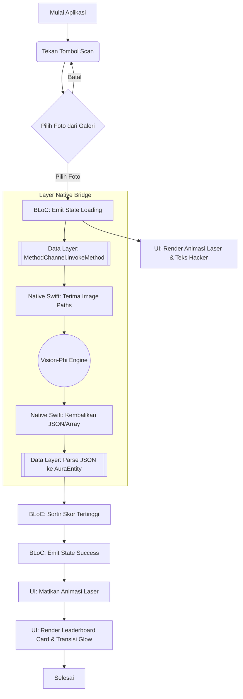
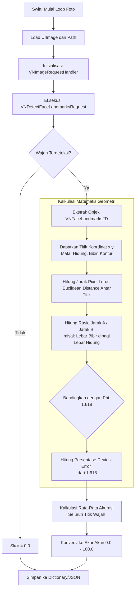

# Technical Requirements Document (TRD): BidadariMeter (Clean Architecture Edition)

## 1. Arsitektur Sistem (Clean Architecture & Native Bridge)
Sistem ini menggunakan standar industri **Clean Architecture** (Presentation, Domain, Data) yang dikombinasikan dengan **Decoupled Native Mobile Architecture** (MethodChannel) dan pola **Dependency Injection (DI)**. 

Tujuannya agar modul Tampilan (UI) dan Otak Pemroses (Matematika & Native Swift) bekerja sebagai entitas terpisah (*loosely coupled*) yang saling berkomunikasi lewat jembatan antarmuka (Interface/Contract).

## 2. Tech Stack (Spesifikasi Teknologi)

### 2.1 The View & Logic (Flutter/Dart Layer)
*   **Arsitektur Standar:** Clean Architecture.
*   **State Management:** BLoC / Cubit (Sangat cocok untuk Clean Architecture).
*   **Dependency Injection (DI):** `get_it` (Sebagai kontainer objek agar UI dan UseCase tidak saling *hardcode*).
*   **Hardware Access:** `image_picker` (akses Galeri iOS).
*   **Styling & FX:** Custom Paint, AnimationController, Glassmorphism (*BackdropFilter*).

### 2.2 The Processor (Native Backend iOS)
*   **Bahasa Utama:** Swift.
*   **Core Engine:** Apple `Vision` framework (`VNDetectFaceLandmarksRequest`).
*   **Communication Bridge:** `FlutterMethodChannel`.

## 3. Pembagian Layer (Clean Architecture)

### 3.1 Data Layer (Penanganan External Source)
Di sinilah letak perbatasan aplikasi Flutter dengan sistem luar (Native iOS).
*   **Data Source (`NativeAuraDataSource`):** Memiliki tanggung jawab tunggal memanggil `MethodChannel('com.nunu.auraapp/engine').invokeMethod()`. Mengirim path foto dan menerima data mentah JSON/Map dari Swift.
*   **Model (`AuraModel`):** Objek struktural untuk mengubah data Map dari Native menjadi objek Dart (`fromJson`).
*   **Repository Implementation (`AuraRepositoryImpl`):** Menjalankan Data Source dan mengkonversi `AuraModel` menjadi `AuraEntity` agar aman dikonsumsi oleh Domain.

### 3.2 Domain Layer (Core Business Rules)
Lapisan murni Dart yang sama sekali **tidak peduli** apakah data berasal dari API, Database, atau MethodChannel iOS.
*   **Entity (`AuraEntity`):** Data kelas murni berisi `imagePath` dan `score`.
*   **Repository Interface (`IAuraRepository`):** Kontrak yang mewajibkan ketersediaan fungsi komputasi skor aura.
*   **Use Case (`CalculateAuraUseCase`):** Fungsi spesifik yang hanya meminta eksekusi skor ke Repository.

### 3.3 Presentation Layer (UI & State)
*   **BLoC/Cubit (`AuraCubit`):** Mengatur State aplikasi (`Initial`, `Loading/Scanning`, `Success`, `Error`). Bergantung mutlak pada UseCase lewat Dependency Injection (DI).
*   **UI (Screens):** Murni menempel ke state BLoC. Saat `Loading`, memutar animasi *Laser Scanner*. Saat `Success`, merender Papan Peringkat.

## 4. Algoritma Penilaian: "Vision-Phi Symmetry Engine" (Native Swift)
*   Swift di `AppDelegate.swift` menangkap *request* MethodChannel.
*   Gambar dikonversi menjadi `VNImageRequestHandler`, lalu `VNDetectFaceLandmarksRequest` dijalankan untuk memetakan koordinat wajah (mata, bibir, hidung).
*   Swift menghitung rasio matematis titik-titik tersebut dan membandingkannya dengan **Rasio Emas / Phi (1.618)**.
*   Nilai penyimpangan / deviasi akurasi dari 1.618 dikonversi menjadi persentase skor aura (0-100%).

## 5. Flowchart Sistem

### 5.1 Flowchart Aplikasi Keseluruhan (Input ke Output)
Bagian ini menggambarkan perjalanan data dari mulai *user* mengklik tombol di Flutter, menyeberang ke lapisan *Native iOS*, hingga hasilnya kembali untuk dirender oleh *Cubit*.



### 5.2 Flowchart Algoritma Pemrosesan (Vision-Phi Engine)
Bagian ini adalah *zoom-in* dari titik `H` di atas. Menggambarkan bagaimana *Native Swift* dan *Apple Vision Framework* menghitung proporsi wajah murni secara lokal.



## 6. Struktur Direktori Proyek
```text
AuraApp/
│
├── ios/
│   └── Runner/AppDelegate.swift      # The Processor (Swift + Vision + MethodChannel Receiver)
│
├── lib/
│   ├── injection.dart                # Dependency Injection (Setup GetIt)
│   ├── main.dart
│   │
│   ├── data/
│   │   ├── models/aura_model.dart
│   │   ├── datasources/aura_native_datasource.dart # (Flutter MethodChannel Caller)
│   │   └── repositories/aura_repository_impl.dart
│   │
│   ├── domain/
│   │   ├── entities/aura_entity.dart
│   │   ├── repositories/i_aura_repository.dart
│   │   └── usecases/calculate_aura_usecase.dart
│   │
│   └── presentation/
│       ├── bloc/aura_cubit.dart      # Mengkonsumsi UseCase via DI
│       ├── pages/home_page.dart
│       ├── pages/leaderboard_page.dart
│       └── widgets/animations/
│
├── PRD.md              
├── TRD.md              
└── EXECUTION_PLAN.md           
```
